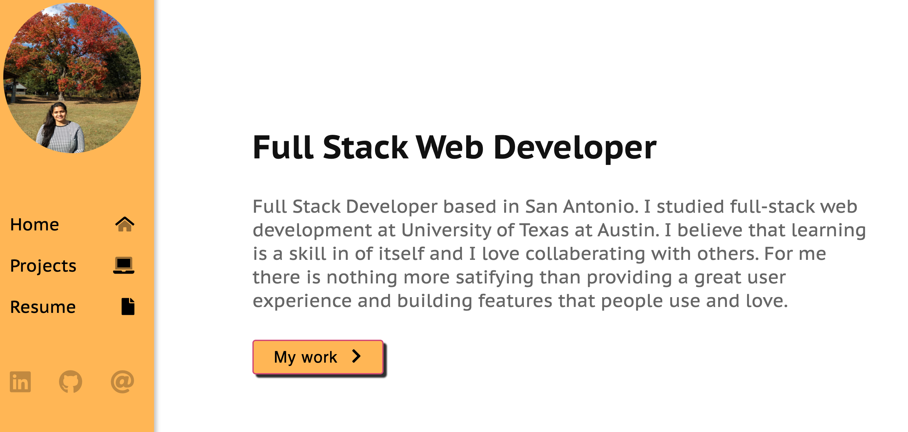

# Overview
I really enjoyed working on it and spent my time i could on it. It's an expandable Project and will continue add on to this portfolio.
This portfolio is in my github page and it will help me organize my projects, events, and writing and then display 'em to the world.

## Table of Contents 

* [Installation](#Installation)
* [Languages Used](#Languages)
* [Final Result](#FinalResult)
* [ResourceReferred](#ResourceReferred)
* [Github_Links](#Github_Links)

## Installation
To install this code, download the zip file, or use GitHub's guidelines to clone the repository., Links are provided below in resources

## Languages used
1.Javascript 
2.HTML 
3.CSS

## Final Result
### ScreenShots

## ResourceReferred
[For Portfolio] github online repositories. 
[For concepts] https://stackoverflow.com/questions/3275164/javascript-quiz  

## Github_Links
[**URL of My Github Repository**](https://github.com/guptaria/updated_portfolio) 
[**URL of Deployed Application**](https://guptaria.github.io/updated_portfolio/.)

